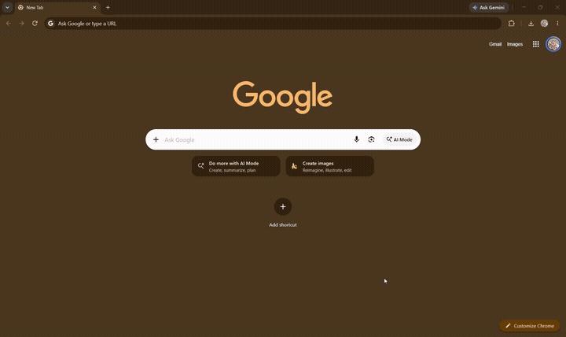

# FlipNoteChrome

FlipNoteChrome is a lightweight Windows tray app that turns a Chrome window into a focused writing surface with a smooth 3D flip transition.

Hold **Alt** and click Chrome's title bar to flip from Chrome to a note. Write, then press **Flip Back**, `Esc`, `Ctrl+Alt+F`, or Alt-click the note header to return to Chrome.

## Features

- Smooth perspective flip between Chrome and the note editor
- Global Alt + title-bar click gesture
- `Ctrl+Alt+F` hotkey for the focused Chrome window
- Clean, Notepad-style writing editor
- Compact formatting actions for headings, lists, emphasis, links, and tables
- Autosave and version history
- Search and export from the tray settings window
- Per-window note identity with title aliases
- Optional always-on-top mode, animation speed, font settings, and Windows startup
- DPI-aware overlay tracking
- SQLite storage in the user's application data directory

## Demo

Watch the recorded Chrome-to-note flip demo:



[Download / view the demo video](demo/demo.mp4)

The demo shows the main interaction: flipping from Chrome to the writing surface, editing a note, and returning to Chrome.

## Requirements

- Windows 10 or Windows 11
- Google Chrome
- .NET 8 SDK for building from source

The app uses Windows desktop APIs for the global mouse hook, window capture, hotkeys, and overlay positioning.

## Build from source

```powershell
dotnet restore FlipNoteChrome.sln
dotnet build FlipNoteChrome.sln --configuration Release
```

The executable is produced under:

```text
FlipNoteChrome.UI/bin/Release/net8.0-windows/
```

Run `FlipNoteChrome.UI.exe`. The application starts in the system tray.

## How to use

1. Start FlipNoteChrome.
2. Open one or more Chrome windows.
3. Hold **Alt** and click the Chrome title bar.
4. Write in the note surface.
5. Use **Flip Back**, `Esc`, `Ctrl+Alt+F`, or Alt-click the note header to return to Chrome.

Double-click the tray icon to open settings.

## Data and privacy

Notes and settings are stored locally at:

```text
%APPDATA%\FlipNoteChrome\notes.db
%APPDATA%\FlipNoteChrome\settings.json
```

No note data is sent to a server by this application. The global mouse hook is used only to detect the configured Chrome title-bar gesture.

## Project structure

- `FlipNoteChrome.Core` — window identity, hooks, native interop, SQLite storage, and settings
- `FlipNoteChrome.UI` — WPF tray app, editor surface, overlay tracking, and flip animation
- `FlipNoteChrome.sln` — Visual Studio / .NET solution

## Known limitations

- Chrome must be running on the same Windows desktop session.
- Window identity is inferred from executable path, window class, and normalized title; title changes are handled with best-effort aliases.
- Windows security restrictions or another application already using the hotkey can prevent hook or hotkey registration.

## License

No license has been selected yet. Until a license is added, all rights are reserved by the copyright holder.
